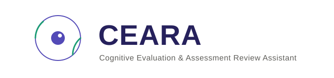
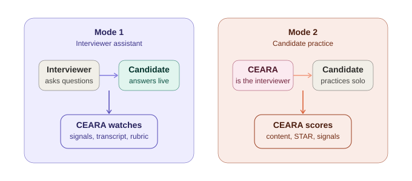
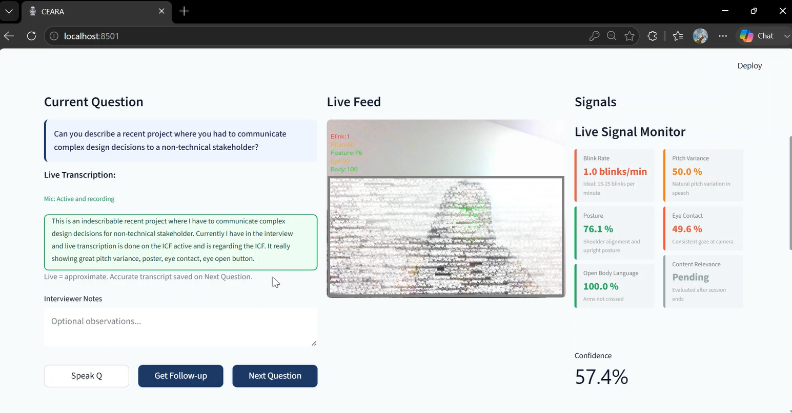
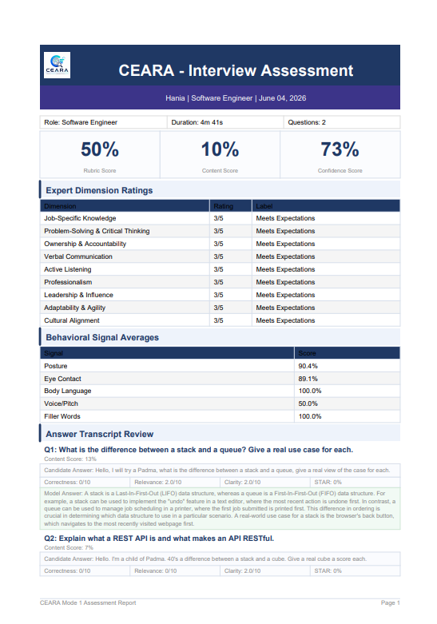
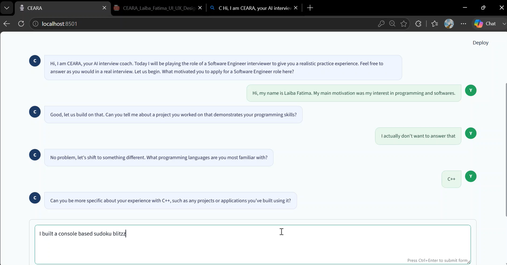
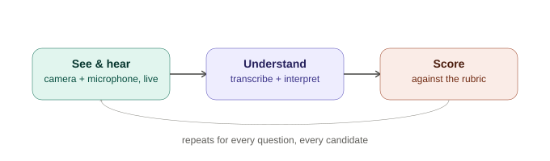
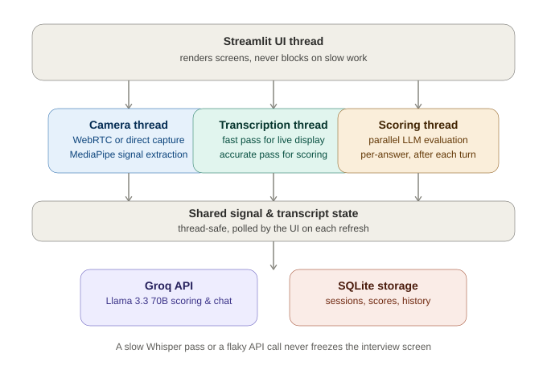
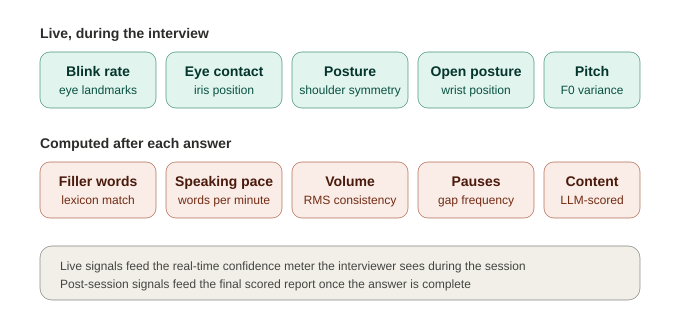

### Cognitive Evaluation & Assessment Review Assistant

**An AI interview evaluation system that watches, listens, and scores — in real time.**

[Overview](#overview) · [Demo](#demo) · [How It Works](#how-it-works) · [Architecture](#architecture) · [Signals](#the-ten-signals) · [Tech Stack](#tech-stack) · [Team](#team)

---

## Overview

Most interview practice tools either grade what you *typed* or grade what you *said* — never both, and never in the same breath as a real interviewer would. CEARA was built to close that gap.

CEARA is a dual-mode system. **Mode 1** turns a laptop into a live co-pilot for an actual human interviewer — tracking eye contact, posture, and speech patterns on a candidate while the interviewer asks real questions, with every answer transcribed and scored against a rubric the interviewer designs themselves. **Mode 2** flips the role: CEARA *becomes* the interviewer, holding a natural spoken or typed conversation with a candidate, probing their answers, and producing a structured performance report at the end.

It was designed, built, and exhibited as a 4th-semester Artificial Intelligence project — and ended up touching almost every major AI discipline at once: computer vision, speech processing, NLP evaluation, and applied LLM reasoning, all wired together into one working product rather than five separate notebooks.

 

---

## Demo

> 🎥 **Exhibition demo video** — *placeholder: add a 2–3 min screen recording link here (YouTube/Drive) once uploaded.*

> 🖼️ **Screenshots** — *placeholders below for exhibition photos and screen captures. Drop images into `assets/screenshots/` and update the paths.*

<table>
<tr>
<td width="50%">

Mode 1 — live interview screen with signal monitor

</td>
<td width="50%">

Mode 1 — rubric-scored candidate assessment report

</td>
</tr>
<tr>
<td width="50%">

Mode 2 — CEARA conducting a spoken practice interview

</td>
<td width="50%">

Live at the Fall 2024 AI exhibition

</td>
</tr>
</table>

---

## How It Works

CEARA's job, in both modes, is the same three-step loop: **see and hear the candidate → understand what they said → score it against a standard.** What changes between modes is who is asking the questions.

 

### Mode 1 — Interviewer Assistant

A real human runs the interview. CEARA sits quietly alongside, doing the parts a human interviewer can't do well while also talking — reading body language continuously, transcribing every word, and keeping score against criteria the interviewer defines in advance.

| Step | What Happens |
|---|---|
| **Setup** | Interviewer configures the session once — job role, difficulty, number of candidates, time limits, and a fully custom rubric where *they* decide which traits are scored by AI signals, which by AI content analysis, and which they'll rate themselves live |
| **Questions** | Interviewer writes their own questions, optionally with a model answer, or asks CEARA to suggest role-specific questions based on required skills |
| **Live interview** | Camera and microphone run continuously in the background; transcription appears in near real time as the candidate speaks; the interviewer can request an AI-generated follow-up question on the spot |
| **Per-candidate report** | Immediately after each candidate, a rubric-weighted score, full answer transcripts, and signal breakdown are generated |
| **Session report** | After the last candidate, all candidates are ranked against each other with a hire recommendation |

### Mode 2 — Candidate Practice

Here, CEARA *is* the interviewer. A candidate can either work through a structured set of practice questions, or have a free-flowing spoken conversation where CEARA reacts to what they actually say, probes vague answers, and decides on its own when the interview has covered enough ground.

| Step | What Happens |
|---|---|
| **Setup** | Candidate picks a role, difficulty, and how they want to respond — typed, spoken, or spoken-on-camera |
| **Practice Mode** | Structured Q&A with a timer, instant filler-word and STAR-structure feedback per answer |
| **Conversation Mode** | CEARA introduces itself, asks questions naturally, reacts to the answer, and decides when to move on — closing the interview itself when it's covered enough ground |
| **Report** | Content accuracy, communication clarity, behavioral signal averages, STAR scoring per answer, and targeted practice questions for weak areas |

---

## Architecture

The system is built around one rule: **nothing should ever freeze the interview.** Camera capture, speech transcription, and LLM scoring all run on independent background threads — a slow Whisper transcription never blocks the next question from loading, and a flaky internet connection never freezes the candidate's video feed. The interviewer can switch between a browser-based camera (WebRTC) and a direct hardware camera (OpenCV) mid-session with zero interview downtime — a decision made specifically so the system could survive an exhibition hall with unpredictable Wi-Fi.

---

## The Ten Signals

CEARA's confidence scoring is built from ten measurable behavioral and verbal signals — five read live from the camera and microphone, five computed from the recorded audio after each answer.

 

<strong>See how each signal is actually computed</strong>

 

| # | Signal | Method |
|---|---|---|
| 1 | **Blink Rate** | Eye Aspect Ratio (EAR) from facial landmarks, smoothed over a rolling 60-second window; ideal range 15–25 blinks/min |
| 2 | **Filler Words** | Whole-word regex match against a curated filler lexicon ("um", "uh", "basically"...) on the final transcript |
| 3 | **Speaking Pace** | Words-per-minute from Whisper's word-level timestamps; ideal range 120–160 WPM |
| 4 | **Volume Consistency** | Variance of RMS energy across the recorded answer — steadier volume scores higher |
| 5 | **Pause Frequency** | Gaps greater than 1.5s between consecutive transcribed words |
| 6 | **Pitch Variance** | Pitch (F0) extracted via `librosa.pyin`; natural variation is rewarded, monotone or erratic pitch is penalized |
| 7 | **Posture** | Shoulder landmark symmetry from MediaPipe Pose — uneven shoulders signal slouching |
| 8 | **Eye Contact** | Iris position relative to the eye socket (not relative to the camera frame) — robust to head movement |
| 9 | **Open Body Language** | Wrist position relative to the torso midline — flags crossed-arm postures |
| 10 | **Content Relevance** | LLM-evaluated correctness, relevance, and clarity of each answer against the question (and an optional model answer) |

---

## What Makes This Different

- **The interviewer's rubric, not a fixed one.** Most "AI interview" tools impose their own scoring model. CEARA lets the interviewer decide, per dimension, whether it's scored by AI signals, AI content analysis, or their own live judgment — and weights everything however they want.
- **A conversation, not a form.** Mode 2's Conversation Mode doesn't march through a fixed question list. CEARA listens to what was actually said, asks a real follow-up, and decides for itself when the interview has run its course — closing the conversation the way a human interviewer would.
- **Built to survive the room it's demoed in.** Camera and transcription run on independent background threads specifically so a slow network or a sluggish Whisper pass never freezes the interview — a constraint that came directly from testing in an unpredictable exhibition environment.
- **Honest two-tier transcription.** A fast, approximate model shows the interviewer *something* is being heard in real time; a slower, more accurate model produces the transcript that actually gets scored — so speed and accuracy stop being a trade-off.

---

## Tech Stack

| Layer | Technology |
|---|---|
| **Interface** | Streamlit |
| **Computer Vision** | MediaPipe (Face Mesh + Pose), OpenCV |
| **Speech-to-Text** | faster-whisper (tiny + base, two-tier pipeline) |
| **Audio Processing** | librosa, sounddevice, webrtcvad, noisereduce |
| **Language Model** | Groq API — Llama 3.3 70B |
| **Camera Transport** | streamlit-webrtc (online) · OpenCV direct capture (offline) |
| **Storage** | SQLite |
| **Reporting** | ReportLab (PDF generation), Plotly (charts) |

---

## Project Snapshot

| | |
|---|---|
| **Course** | Artificial Intelligence — BSCS, 4th Semester |
| **Duration** | 4-week build, from architecture to exhibition |
| **Behavioral signals tracked** | 10 |
| **Interview modes** | 2 (Interviewer Assistant · Candidate Practice) |
| **Camera transport modes** | 2 (WebRTC · Direct/OpenCV, switchable live) |
| **Candidate input modes** | 3 (Text · Audio · Video) |

---

## Team

Built and exhibited by:

- **Laiba Fatima** — LLM integration, authentication, reporting (PDF/dashboard), conversational interview engine
- **Muhammad Zain Zaheer** — Computer vision signals, camera pipeline, audio capture & transcription

**Supervised by:** Ma'am Tehreem Aslam · **Checked by:** Mubashra Chaudhary

---

This repository is a project showcase — it documents the system's design and outcomes without exposing the underlying implementation.

